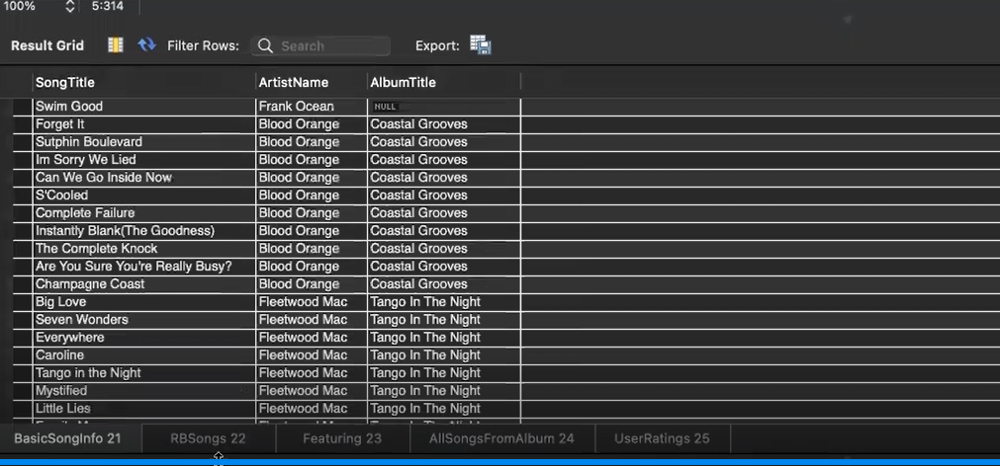

# Simple Music Library Database

## Motivation
CSC 430 Term Project: We were tasked to create a relational database system and we chose to make a simple music library database that stores some of our favorite songs and albums along with various funtions to siplay the data to the user.

## What I Learned
+ Creating E/R models and translating them into relational designs
+ Enforcing integrity contraints
+ Implementation of views and triggers to allow the user to display specific data with related attributes. <br>
<br>Example of View used to display all songs of the same genre: <br>

```SQL
create view RBSongs AS
SELECT a.ArtistName , s.SongTitle, Genre
FROM ARTIST a , SONG s
WHERE a.ArtistID = s.ArtistID AND Genre='R&B/Soul';
```
&emsp;&emsp;Output: <br>


